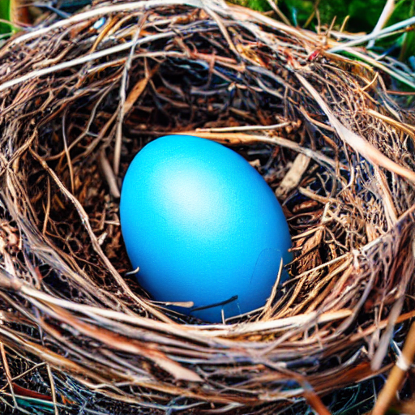

# Nested Diffusion Processes for Anytime Image Generation
<a href="https://github.com/noamelata">Noam Elata</a>, <a href="https://bahjat-kawar.github.io/">Bahjat Kawar</a>, <a href="https://tomer.net.technion.ac.il/">Tomer Michaeli</a>, and <a href="https://elad.cs.technion.ac.il/">Michael Elad</a>, Technion.<br />



🤗  [`Huggingface Demo`](https://huggingface.co/spaces/noamelata/Nested-Diffusion) 

## Preparation

Please refer to `environment.yml` for packages that can be used to run the code. 

Pretrained models will download automatically upon running the relevant scripts.

## Sampling from Nested Stable Diffusion
This code implements Nested Diffusion, used with Stable Diffusion v1-5 and the <a href="https://github.com/huggingface/diffusers">Diffusers library</a>.

Image generation can be run with the following script:
```
python sample_text_to_image.py --outer <number of outer steps> --inner <number of inner steps>  \
               --outdir samples --prompt "<your text prompt>"
```
Default parameters reproduce the image shown at the top.

To run Nested Diffusion with accelerated <a href="https://github.com/LuChengTHU/dpm-solver">DPM-Solver++</a> inner diffusion scheduler, please add the `--dpm-solver` argument to the script.
It is possible to use fewer inner steps with DPM-Solver++.

If you have less than 10GB of GPU RAM available please add the `--fp16` argument to the script.


## ImageNet Generation with Nested Diffusion 
This code implements Nested Diffusion, used with <a href="https://github.com/facebookresearch/DiT">DiT</a> as a pretrained model.

Image generation with Nested Diffusion can be run with the following script:
```
python generate_imagenet.py --steps <number of outer steps> --nested <number of inner steps> \
               -n <number of samples to generate> -b <batch size> \
               -o <output directory path> --cfg <value of CLF to use>
```
For Vanilla DiT diffusion process please run with the following arguments:
```
python generate_imagenet.py --steps <number of vanilla steps> \
               -n <number of samples to generate> -b <batch size> \
               -o <output directory path> --cfg <value of CLF to use>
```
This script will save all intermediate predictions in separate directories.

For multi-GPU sampling or ddim sampling,  please see the usage of `generate_imagenet.py`.


## References and Acknowledgements
```BibTeX
@article{elata2023nested,
  title={Nested Diffusion Processes for Anytime Image Generation},
  author={Elata, Noam and Kawar, Bahjat and Michaeli, Tomer and Elad, Michael},
  journal={arXiv preprint arXiv:2305.19066},
  year={2023}
}
```
